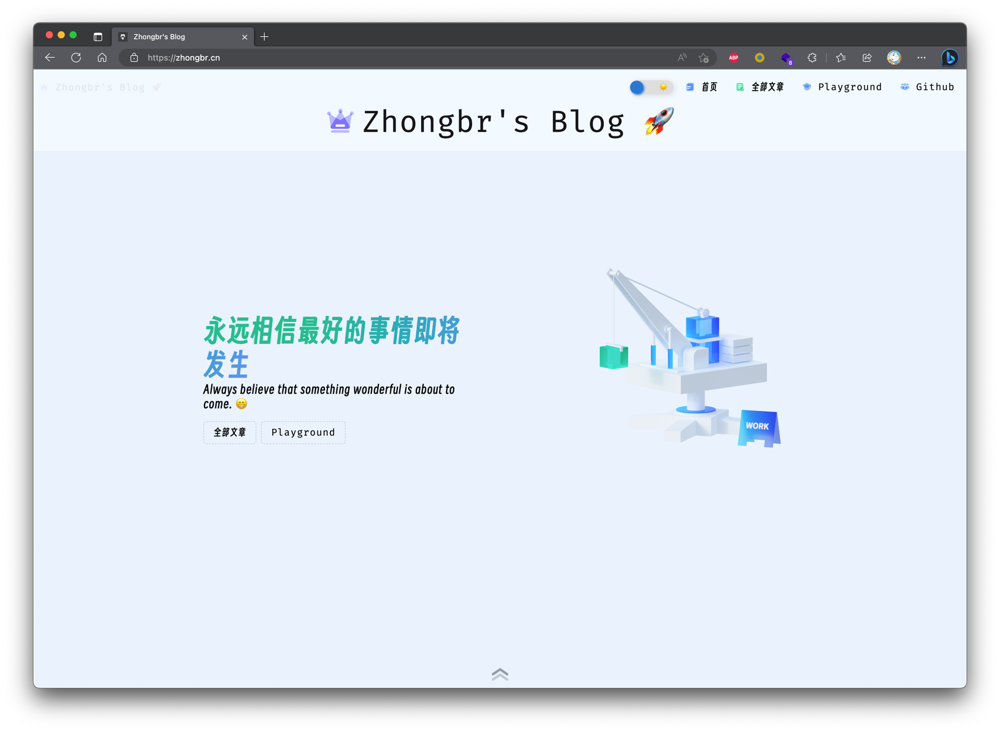
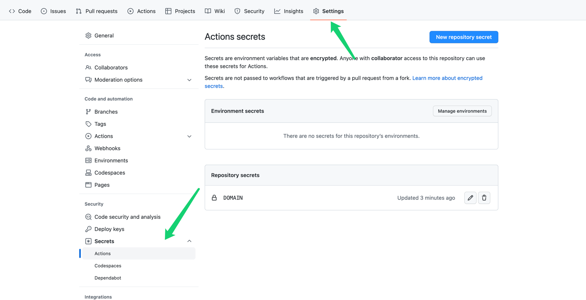
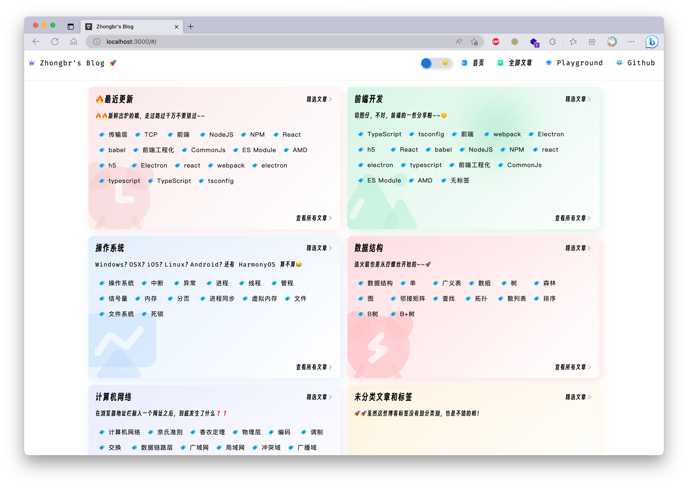

# React + Github Actions 纯静态个人博客

## 预览

点击链接预览 [Zhongbr's Blog](https://zhongbr.cn)



React + GitHub Actions + Github Pages ，不需要部署后端服务，自动构建的静态博客，相比传统的 Jekyll 博客引擎，React 更加强大，可玩性更高。

对 博客网站本身的修改，Github Pages 配置在 `gh-pages` 分支，向 `main` 分支 `push` 时，会触发 Github Actions 执行
构建命令，构建产物将被 `push` 到 `gh-pages` 分支，供 Github Pages 访问。

## 1. NPM 脚本命令

| 脚本              | 功能描述                                  |
|-----------------|---------------------------------------|
| build-website   | 构建博客网站资源                              |
| build-markdown  | 构建 markdown 文章，生成 json 文件和文章目录        |
| start-website   | 在本地起一个博客 demo                         |

## 2. 如何起一个博客

### 1. Fork 本仓库

Fork 本仓库, 进入到 Fork 的仓库

### 2. 修改仓库的 Actions 设置

新建一个 `secret`，名称使用 DOMAIN，这个是最后部署的博客的域名，在构建之前需要先参考 github pages 的文档对域名进行解析配置。



### 3. 编写博客文章

将博客文章的 markdown 放到 `/packages/demo-site/posts`.

然后 `push` 到 github 的 `main` 分支，Github Actions 就会自动开始部署

可以在博客文章的开始，按照下面的格式设置元数据，指定博客的标题等内容、也可以通过 recommend 字段指定将文章展示在首页的某个 Topic 的推荐目录下
```
---
title: my hello world blog title
tags: ['tag1', 'tag2']
recommend: topic-id
cover: 'link to the cover image'
---
```
`/demo-site/posts` 目录下的第一级目录会成为首页的 Topic 板块，每个目录下需要有一个 `topic.yaml` 文件，用于指定 Topic 板块的元数据。

内部目录可以是任意结构，markdown 会被在 发布 时编译成 ast 的 json文件，其他的文件会被直接复制到 `gh-pages` 分支。



下面是一个示例：
```yaml
topic:
    id: 'frontend'
    topicName: '前端开发'
    icon: 'rp-tupian'
    color: '#7adfb032'
    desc: '切图仔，不对，前端的一些分享啦~~🤔'
```
