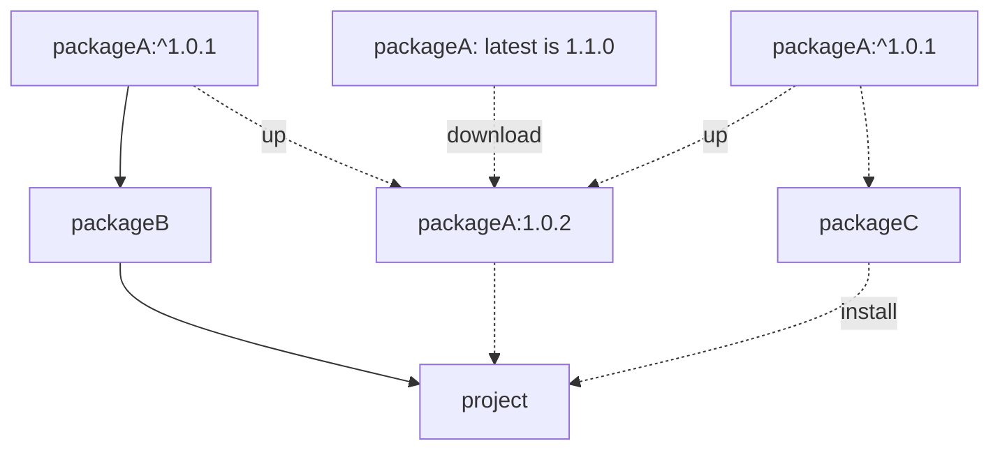

# NPM 依赖更新算法

> 在工作中，同事遇到一个问题，和我一起研究了下：
同事的项目里原本的 package-lock.json 将一个 NPM 包 packageA 锁定在了 1.0.1，但是在 TA 使用 npm install 来更新一个 packageC 的版本时，神奇的事情发生了，另一个包 packageA 和 TA 的项目不兼容了，项目直接跑不起来了。
同样的代码，clone 到我的电脑上，就可以正常启动。
> 

同样的代码，在一个电脑上可以启动，而另一个电脑上不能启动，那自然会联想到是环境的问题。

同事 TA 使用的 NodeJS 14，npm 版本是 6.x，而我使用的 NodeJS 版本是 16，npm 版本是 8.x。

即使是有 package-lock.json，使用不同版本 npm，对同一个项目的依赖进行安装时，安装到的依赖版本号是可能存在差异的，这是由于不同版本的 NPM 在 `npm install` 或者 `npm update` 时的策略是不一样的。

⚠️⚠️：**不止有执行 `npm update` 时会更新依赖，在有些情况下执行 `npm install` 也会更新依赖**。

# NPM 6.x 嵌套更新

对于比较老的 NPM 版本，执行 `npm install` 时，npm 会根据 package.json 和 package-lock.json 文件中的依赖树，检查需要更新的依赖包。

对于需要更新的依赖包，npm 会从底层（依赖树的叶子节点）开始，逐层向上更新，同时检查每一层的依赖包是否冲突，**对于冲突的包，npm 会尝试升级以解决冲突**。这个升级的过程可能会导致依赖树发生变化，从而**更新 package-lock.json**。

## npm 6.x 的嵌套更新的问题

NPM 6.x 的这种嵌套更新的机制，没有考虑到间接依赖的升级对项目稳定性的影响。

packageB 和 packageC 均依赖 packageA：



- 一个项目中开始只有 packageB，package-lock.json 中**将 packageA 的版本锁定在 1.0.1 版本**。
- 过了一段时间，packageA 的作者发布了 1.1.0 版本，虽然修订的是子版本号，但是这个包里**仍有些不可向下兼容的代码（业务开发也很难让所有人都按照规范更新版本号）。**
- 又过了一段时间，我需要向 project 中安装一个 packageC，执行 `npm install packageC` ，虽然 packageC 和 packageB 对 packageA 的版本约束一致。
    
    但是**由于 npm 6.x 检测到有符合版本约束的新版本（1.1.0）包发布**，所以会下载 1.1.0 版本的包安装到项目里,并且这个 1.1.0 版本的 packageA 是 packageB 和 packageC 共同引用的，又无法向下兼容，导致项目无法启动。
    

# NPM 8.x 自适应更新策略

造成这场事故的罪魁祸首，就是 NPM 6.x 嵌套更新策略，这个策略过于激进，它会更新 packageC 依赖树中所有的包（自然包括了 packageA）而导致项目不稳定。既然找到了 NPM 6.x 出问题的原因，那为什么在我的电脑上执行同样的操作就不会报错，可以正常启动呢？

这个就得益于 NPM 8.x 推出的**自适应的更新策略**了，自适应的更新策略相对于 NPM 6.x 而言，其更新时影响的范围更小：

- npm 8 的自适应更新算法会先尝试**更新直接依赖：**
    - 没有冲突，则**直接更新成功**。
    - 发现了冲突，npm 会分析冲突的原因，并尝试自动解决冲突，如果自动解决不了，则会停止更新，提供相应的错误信息和建议。

由此可见，在使用 NPM 8.x，在执行 `npm install packageC` 操作时，会首先尝试直接安装 packageC，对于 packageC 依赖树上项目里原本就存在的包，在**不冲突时采用项目中的版本。**自然也就不会更新 packageA 了。

# 问题的解决方案

分析清楚了问题发生的条件和原因，解决方案就很明确了，这里列出三种解决方案：

## 方案一：升级 NPM 版本到 8.x

升级 NodeJS 和 NPM 版本肯定是最优雅的解决方案

优点：不需要对项目进行任何的修改就可以解决问题

缺点：本地的 NodeJS 环境自然是好升级的，CI/CD 上的 NodeJS 和 NPM 版本升级起来就要考虑很多了，它是公司所有项目发布都需要经过的流程，如果影响到其他的工程打包，或者埋下了暗坑，又是一场惨痛的事故。

## 方案二：手动修改 package-lock.json 中 packageA 的版本

手动修改 package-lock.json 里 packageA 的版本为 1.0.1。

优点：既然选择升级 NodeJS 和 NPM 的成本很高，那我修改 package-lock.json 里 packageA 的版本，就不会影响别的项目了。

缺点：治标不治本，解决得不持久，如果下次再升级 packageC 或者安装依赖了 packageA 的包，那同样的问题又会再次出现。

## 方案三：在项目的 package.json 里将 packageA 作为直接依赖，并约束版本号

修改项目 package.json ，在 dependencies 里增加

```json
{
	"packageA": "~1.0.1"
}
```

只接受修订版本号更新，这样 NPM 6.x 就不会下载 packageA 的 `1.1.0` 版本了。

这三种方案都可以解决问题，但是不推荐使用第二种方案，这种方案会降低项目的稳定性，下次换个人又会一脸蒙圈了。

至于方案一和方案三，就结合实际情况选择即可。

## 方案零：使用 PNPM

这种方案适用于包与包之间的不兼容导致的项目报错：

例如项目无法启动是由于 `1.1.0` 的 packageA 和 packageB 的内部逻辑冲突而导致的无法启动，使用 pnpm 之后，packageB 和 packageC 使引用的 packageA 就是隔离开的了，更新 packageC 并不会影响 packageB 中 packageA 的版本。

但是，同事的项目无法启动，是由于 `1.1.0` 版本的 packageA 与**项目自身的脚手架不兼容**，属于语法层面的不兼容，并不是由于 packageB 和 packageC 引用了同一份 packageA 导致的，所以用不用 pnpm 不是重点。
