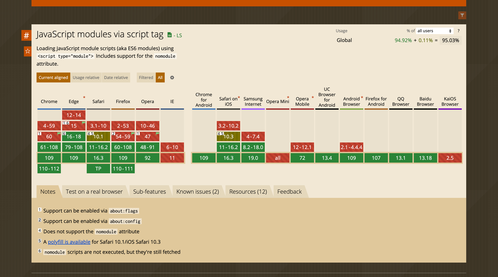

# 如何在博客上展示可交互的代码片段?

我们在日常编写博客的时候，经常会书写一些 Jsx 的 DEMO 代码，其他人在浏览我们的博客文章的时候就可以参考一下这些 DEMO 代码。
*有没有一种方法，可以在其他人浏览我们的博客文章的时候，直接把 JSX 编写的代码片段，给渲染成真实的 dom 节点*，不仅在博客内可以用到，在编写组件文档的时候就会非常有用。

就像下面这段 DEMO 代码一样，你不妨点击一下 "预览" 按钮，就可以直接看到这段代码渲染成真实的 dom 之后的样子，甚至还可以进行交互。

```tsx
// <live-demo>
import React, { useState } from 'react';
// 可以直接从 unpkg.com 自动导入满足 umd / amd 规范的依赖
import { Button, Modal } from 'antd';

const CompTest: React.FC<{}> = props => {
    const [show, setShow] = useState(false);
    
    return (
        <>
            <Modal
                visible={show}
                title="这是一个 ant-design 的弹窗"
                onCancle={() => setShow(false)}
                onOk={() => setShow(false)}
            >
                <span>这是弹窗的内容 🚀</span>
            </Modal>
            <Button type="primary" onClick={() => setShow(true)}>点击Antd按钮</Button>
        </>
    )
}

export default CompTest;
```

> 这个能力，已经封装为 npm 包，提供了 React组件以及 Webcomponent 组件，可以在各种框架的项目中使用。
> ```shell
> npm install @zhongbr/code-sandbox
> ```

## 实现思路

要想在博客网页内展示代码片段，需要考虑解决的问题：
- 如果是 React、Vue 等代码的片段，如何让浏览器识别 JSX ?
- 对于代码片段内使用到的第三方依赖，要如何获取？
- 如何让代码片段和博客网页的环境隔离？

## 如何让浏览器识别 JSX 或者 Vue 模板？

对于 Vue 的模板，比较好解决，Vue 框架本身就支持渐进式引入，直接在已有的 html 页面上运行。

但是 React 没有渐进式引入的方式，对于 JSX 的处理是在构建阶段

JSX 是一种 JavaScript 扩展语法，用于在 JavaScript 中描述 UI，拥有 JavaScript 的所有特性，相对于其他的模板，具有非常高的灵活性。
但是 JSX 是不可以直接被浏览器识别的，需要经过构建工具构建之后，转换成可以普通的 JavaScript 代码之后，才可以在浏览器中运行。


想让浏览器可以执行 JSX 代码有两种思路：
- 构建阶段转换，直接将 demo 中的 JSX 代码也一起转换成 JavaScript
- 运行时转换，在浏览器中加入一个转换的逻辑，将 JSX 代码转换成 JavaScript，然后通过 Function 、 eval 等方式进行执行。

在构建阶段进行转换，实现成本较低，并且执行时的**性能也更高**，但是这样做会缺乏灵活性，构建完成后无法动态地修改 JSX 的代码，比较适用于只做展示的场景，如果是组件文档需要实时编辑的话，就无法通过这种方式来实现了。

市面上还有一些产品，比如 [CodeSandbox](https://codesandbox.io) ，是通过将代码在服务端构建，然后直接将 html 通过 url 的方式提供给浏览器展示的方式实现，这种方式兼顾了性能和灵活性，
但是需要提供一个后端服务，成本是非常高的，土豪可以试试用这种方式。

对于一个个人博客或者说一个开源组件的文档来说，成本最低的方式当然是能够在一个静态的页面中进行，而不需要依赖任何后端服务，这样仅需一个 Github Pages 就可以了。

### Babel Standalone

Babel 是前端工程化里使用最广泛的 JS 预处理器，让我们可以在编写代码时使用一些最新的或者浏览器还不支持的特性，转换成浏览器可以识别的代码。
Babel 除了可以用在 NodeJS 构建编译阶段以外，还提供了 @babel/standalone 包，可以直接在浏览器内运行。

基于 Babel standalone ，我们就可以实现在浏览器内将 JSX 代码转换成 JS，然后进行执行。

[@babel/standalone 文档](https://babeljs.io/docs/en/babel-standalone)

@babel/standalone 内置了 `react` 的 preset，只需要在 transform 传入 preset: ['react'] 就可以实现将 JSX 转换成 js 的能力了。

搭配 `registerPlugin` 接口，实现一个 babel 插件，来对 AST 进行操作。

## 对于代码片段内使用的第三方依赖要如何获取？

jsdelivr 和 unpkg 等开源 CDN 上收录了 npm 和 github 上的资源，并且可以通过拼接 url 的方式，直接获取到。

找到获取依赖脚本的渠道，那么要解决第三方依赖的问题，就需要把这些脚本组织到一起，本质上就是要实现模块管理的机制，目前整个前端生态来看，各种新的旧的、官方和社区维护的模块机制都有，cjs、umd、amd、es module 等等。
就算是在 NodeJS 里，也没有一个统一的引入方式来引入各种规范的依赖。

### CommonJS 模块

CommonJS 模块是 NodeJS 默认的模块化规范，使用内置的 `require` 函数导入模块，使用 `exports/module.exports` 导出模块， **`require`函数是同步的**，
如果只是组织本地的模块（AMD就支持，没有必要），其实是可以在浏览器实现的，但是如果需要加载网络资源，同步的 `require` 就不太行了，整个页面都会阻塞。

### ESM 模块


现在绝大部分的浏览器都原生支持 ESM 模块化，如果只用到 ES Module 的模块，借助标准的 `<script type="module"></script>`就可以实现，并且浏览器内置的 es module 可以直接 import 网络资源。

### umd、amd 模块

[umd(Universal Module Definition)](https://github.com/umdjs/umd) 模块是可以通过 cjs、amd 或者浏览器全局变量等多种方式来组织的，那么我们只需要在 sandbox 里实现 amd 规范，就可以支持 umd 格式的包了。

如果只是需要一个纯粹的 AMD 实现，那么直接用[amdjs](https://github.com/amdjs/amdjs-api)即可，但是我想将 AMD 和 unpkg、jsdelivr 等 cdn 结合到一起，require 本地不存在的依赖时，自动从 cdn 上下载。

自己实现一个 amd 模块，也就是 [@zhongbr/code-sandbox/es/core/amd](https://github.com/zhongbr/zhongbr-blog/tree/main/packages/code-sandbox/src/core/amd)，实现一个插件机制，向插件暴露一些钩子，
插件通过监听钩子的方式，修改 amd 的导入过程。

## 如何让代码片段和博客网页的环境隔离？

代码片段里的代码，安全和稳定性难以得到保证，如果直接在页面里面运行，轻则污染页面全局环境，重则可能由于代码片段报错导致整个页面都白屏不能交互。
所以需要将代码片段的代码与页面代码隔离开，可以将代码片段放到一个 `iframe` 里来运行。

如果直接在 `iframe` 里通过 `src` 嵌入页面，需要知道要嵌入页面的地址，如果要封装成组件，这个是很难做到的，除非在使用组件的时候当做参数传入。
```html
<iframe src="/xxx"></iframe>
```

`iframe` 标签是有一个 `srcdoc` 属性的，使用这个属性可以直接传入一段 html，这样就不需要提前知道嵌入页面的地址。

## 其他优化

整个 Sandbox 里，需要使用到 @babel/standalone , 这个包是非常大的，而且执行起来也比较耗时，所以可以考虑将 babel 提出来放到一个单独的 WebWorker 里，避免 worker 加载或者执行时阻塞页面。

页面和 Worker 或者 Frame 通信，都是使用 `postMessage` 的方式来进行的，`postMessage` 使用结构化克隆的方式将消息序列化之后传递到目标进程，使用 `postMessage` 发送消息，是不受到同源策略限制的，
所以我们可以给运行代码片段的 iframe 开启 sandbox ，只 `allow-script`，不开放其他的权限，和页面之间使用 `postMessage` 来进行通信，这样就可以避免代码片段访问页面内的资源。

由于 iframe 是使用 `srcdoc` 创建的，如果开启 sandbox 但是没有 `allow-same-origin`，那 iframe 的 origin 就是 null，直接 `postMessage` 是会报错的：

```text
Failed to execute 'postMessage' on 'DOMWindow': The target origin provided ('null') does not match the recipient window's origin
```

这个时候需要给 `postMessage` 设置一个 `targetOrigin: '*''` 来解决上面的报错。

```javascript
iframe.contentWindow.postMessage({}, {
    targetOrigin: '*'
});
```
